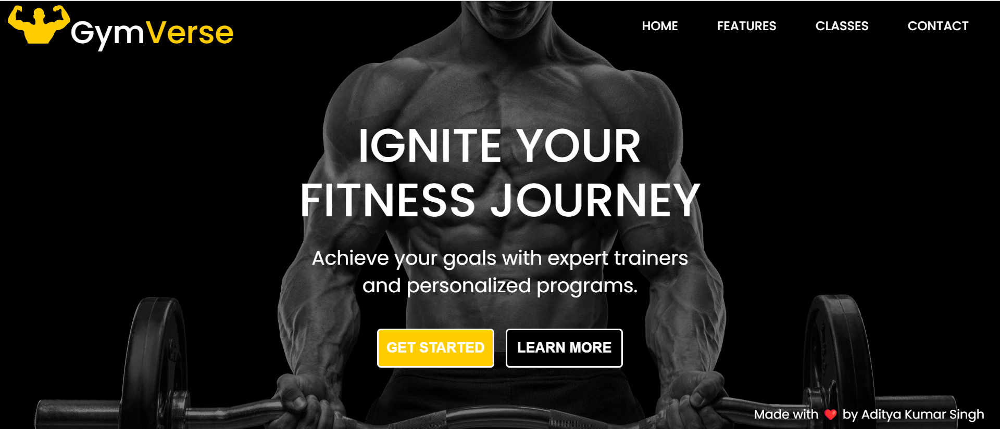
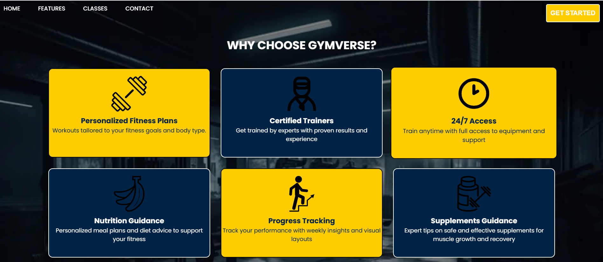
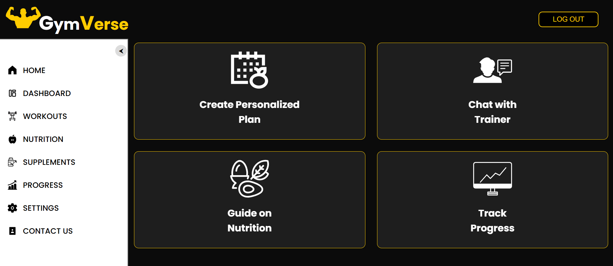
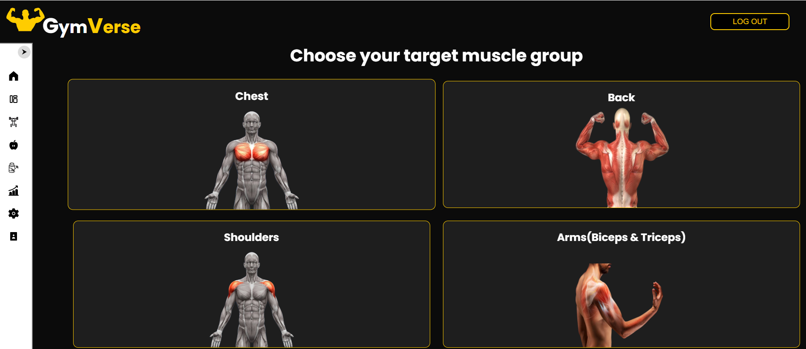
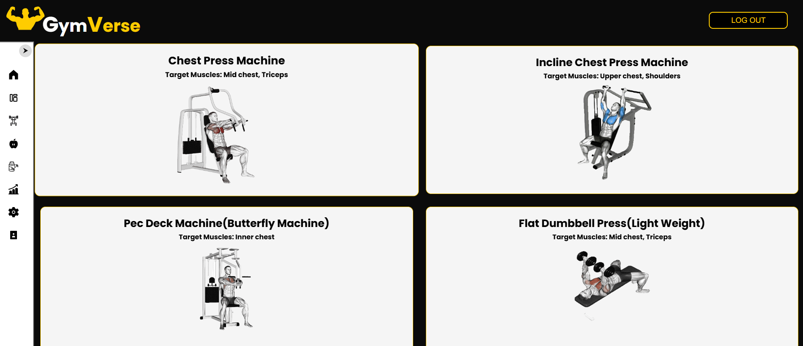
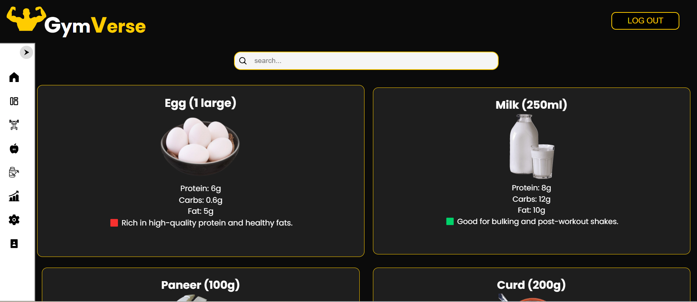
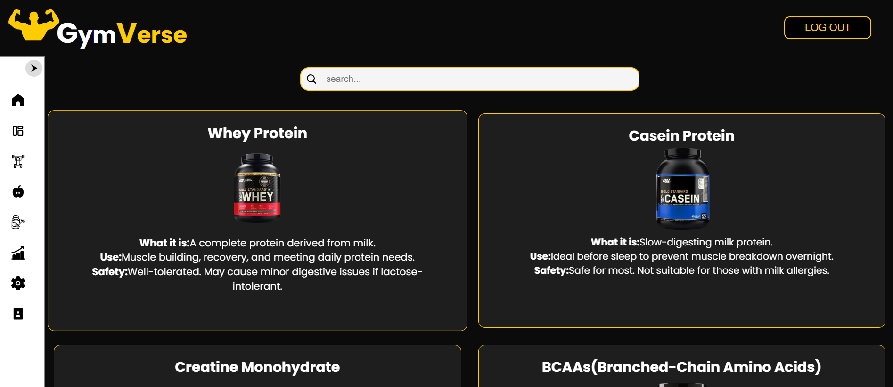
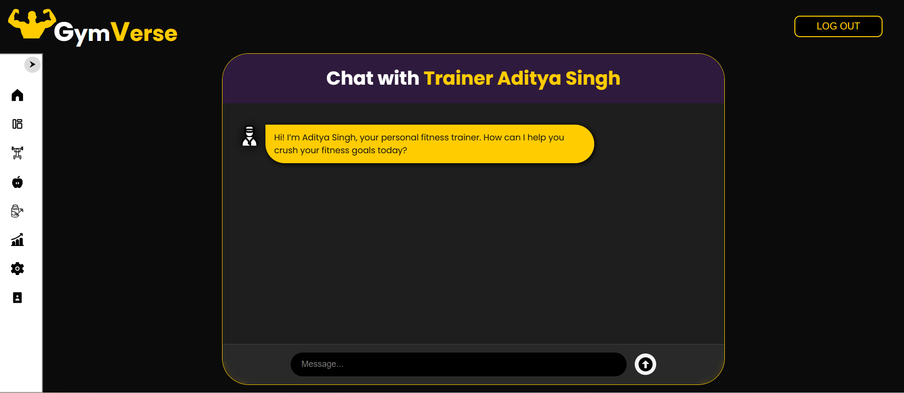
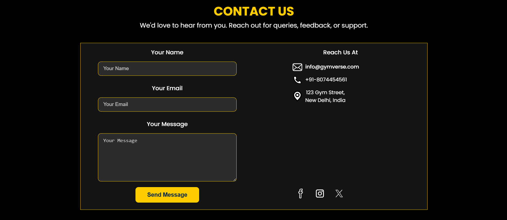

# 🏋️ GymVerse – Your Personal Gym Trainer

🔗 **Live Deployment:**  
https://adityaxletscode.github.io/GymVerse---Your-Personal-Gym-Trainer/

---

## 📌 About GymVerse

**GymVerse** is a comprehensive **fitness-focused web application** designed to act as a personal gym companion.  
It helps users plan workouts, understand nutrition, explore supplements, track progress, and interact with a virtual trainer — all through a clean, modern, and user-friendly interface.

The project is built with **pure frontend technologies** and deployed using **GitHub Pages**, making it lightweight, fast, and easy to access.

---

## 🚀 Key Highlights

- Modern **dark-themed UI** with consistent design
- Smooth **Login → Dashboard → Features** flow
- Sidebar-based navigation for easy access
- Beginner-friendly and scalable architecture
- Built as a **resume-ready real-world project**

---

## 🧭 Application Flow

```
Home → Login → Dashboard →
Workouts | Nutrition | Supplements | Chat | Contact
```

---

## 🛠️ Tech Stack

- **HTML5** – Structure  
- **CSS3** – Styling & Layout  
- **JavaScript** – Interactivity & Logic  
- **GitHub Pages** – Deployment  
- **Git & GitHub** – Version Control  

---

## ✨ Features Explained in Detail

### 🏠 Home Page
- Attractive hero section with strong fitness branding
- Clear call-to-action buttons like **Get Started**
- Introduces users to the GymVerse platform



---

### ⭐ Features Section
- Explains why users should choose GymVerse
- Highlights:
  - Personalized fitness plans
  - Certified trainers
  - Nutrition guidance
  - Supplements guidance
  - Progress tracking



---

### 🔐 Login & Dashboard
- Login system to access personalized features
- Dashboard acts as the central hub
- Quick access cards for major modules



---

### 🏋️ Workout Module
- Muscle-group-based workout selection
- Users can choose:
  - Chest
  - Back
  - Shoulders
  - Arms (Biceps & Triceps)
  - Legs
- Displays exercise machines and target muscles





---

### 🥗 Nutrition Guide
- Shows food items with:
  - Protein, carbs, and fat values
  - Fitness benefits (bulking, recovery, etc.)
- Includes search functionality for easy filtering



---

### 💊 Supplements Guide
- Educates users about common supplements like:
  - Whey Protein
  - Casein Protein
  - Creatine
  - BCAAs
- Clearly explains:
  - What it is
  - Usage
  - Safety considerations



---

### 💬 Chat with Trainer
- Interactive chat-style UI
- Simulates conversation with a personal trainer
- Designed to be extendable with AI or backend support



---

### 📞 Contact Us
- Contact form for queries and feedback
- Displays:
  - Email
  - Phone number
  - Address
  - Social media icons



---

## 📈 Progress Tracker (In Progress 🚧)

- A dedicated **Progress Tracker** feature is currently under development
- Planned features:
  - Workout progress visualization
  - Weekly/monthly fitness insights
  - Charts and performance analytics

> 🔧 **Status:** Actively being worked on

---

## 🎯 Project Purpose

- Apply frontend concepts in a real-world project
- Learn GitHub Pages deployment
- Build a strong **portfolio-level fitness application**
- Create a base for future backend & AI integration

---

## 🔮 Future Enhancements

- Real authentication system
- Backend integration (Node.js & MongoDB)
- AI-powered trainer chat
- Advanced progress analytics
- Mobile responsiveness improvements

---

## 👨‍💻 Author

**Aditya Kumar Singh**  
B.Tech | Web Development | Fitness Tech Enthusiast  

> *Made with ❤️ to combine fitness and technology*

---

## ⭐ Support

If you like this project, please ⭐ the repository.  
It motivates me to keep building and improving 🚀
